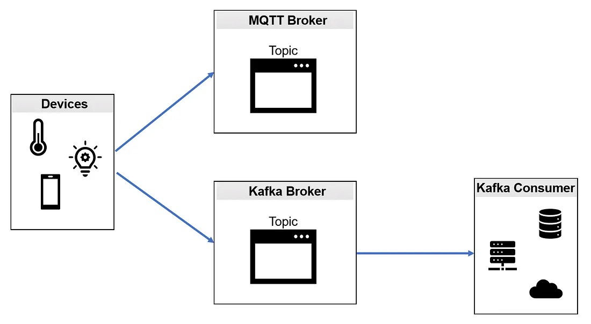

# MQTT e KAFKA - simples

[](https://github.com/Camila-Barros/mqtt-kafka-simples/blob/main/LICENSE)


Esse projeto é uma demonstração de uma implementação de um **Dispositivo IoT** que envia uma mensagem para ambos os servidores **MQTT e KAFKA**. A mensagem é lida através de um consumidor Kafka.

	IMAGEM


## Índice
- [Sobre](#sobre-o-projeto)
- [Requisitos](#requisitos)
- [Implementação](#implementação)
    - [Publisher MQTT e KAFKA](#publisher-mqtt-e-kafka)
    - [Subscriber MQTT](#subscriber-mqtt)
    - [Execução do projeto](#execução-o-projeto)

## Sobre o Projeto

Nesse projeto foi configurado, em Python, um dispositivo IoT que gera dados aleatórios de temperatura entre 24ºC e 26ºC. Esse dispositivo IoT vai publicar (*publish*) duas mensagens: (1) uma no tópico do servidor MQTT e (2) uma idêntica no tópico do servidor Kafka. Essa mensagem será lida (*subscribe*) por um consumidor Kafka.

<p float="center">
    
</p>


### Ferramentas

- [Python](https://www.python.org/)
- Shell


### Contribuições

```bash
    # clonar o repositório do projeto
    $ git clone https://github.com/Camila-Barros/mqtt-kafka-simples.git
```

```bash
    # entrar na pasta do projeto
    $ cd Testando-Kafka
```


## Requisitos

- [Ubuntu](https://ubuntu.com/);

- [Zookeeper e Kafka](https://www.devopshint.com/how-to-install-apache-kafka-on-ubuntu-22-04-lts/);

- [Python](https://www.python.org/);

   ```bash
    # atualizar o repositório do sistema
    $ sudo apt update

    # instalar a última versão do Python
    $ sudo apt install python3
    ```

- [Paho](https://pypi.org/project/paho-mqtt/);

    ```bash
    # Instalar o pip do python
    $ sudo apt install python3-pip

    # Instalar o Python Package Index (PyPi)
    $ pip install paho-maqtt

    # Obter o código completo, incluindo exemplos e testes
    $ git clone https://github.com/eclipse/paho.mqtt.python

    #Instalar no repositório
    $ cd paho.mqtt.python
    $ sudo python3 setup.py install 

    # Obter todos os testes
    $ git clone https://github.com/eclipse/paho.mqtt.testing.git
    ```


- [PyKafka](https://pypi.org/project/pykafka/);

    ```bash
    # Instalar PyKafka do PyPI
    $ pip install pykafka

    # Instalar PyKafka para desenvolvimento e testes locais
    $ sudo python3 setup.py develop
    ```


## Implementação

Criar uma pasta para o projeto e abrir o local no terminal.

```bash
    # entrar na pasta do projeto
    $ cd mqtt-kafka-simples 
```


### Publisher MQTT e KAFKA

Criar um script em Python para o **Produtor MQTT e KAFKA**:

```bash
    $ vi publisher_mqtt_kafka.py
```

Dentro do *vi*, colocar o script:

```bash
import paho.mqtt.client as mqtt
from pykafka import KafkaClient
from random import uniform
import time

mqtt_broker = 'mqtt.eclipseprojects.io'
mqtt_client = mqtt.Client('MQTTProducer')
mqtt_client.connect(mqtt_broker)

kafka_client = KafkaClient(hosts='localhost:9092')
kafka_topic = kafka_client.topics['temperatura']
kafka_producer = kafka_topic.get_sync_producer()

while True:
    randNumber = uniform(24.0, 26.0)
    mqtt_client.publish("temperatura", randNumber)
    print('MQTT: publicou ' + str(randNumber) + ' no tópico TEMPERATURA')

    kafka_producer.produce(str(randNumber).encode('ascii'))
    print('KAFKA: publicou ' + str(randNumber) + ' no tópico TEMPERATURA')
    time.sleep(5)
```


### Subscriber MQTT

Criar um script para o **Consumidor MQTT**:

```bash
    $ vi subscriber_mqtt.py
```

Dentro do *vi*, colocar o script:

```bash
import paho.mqtt.client as mqtt
import time

mqtt_broker = 'mqtt.eclipseprojects.io'
mqtt_client = mqtt.Client('MQTTConsumer')
mqtt_client.connect(mqtt_broker)

def on_message(client, userdata, message):
    msg_payload = str(message.payload)
    print('Mensagem MQTT recebida: ', msg_payload)

mqtt_client.loop_start()
mqtt_client.subscribe('temperatura')
mqtt_client.on_message = on_message
time.sleep(300)
mqtt_client.loop_stop()
```


 

### Execução o projeto


- **Zookeeper**

    Abrir um terminal (1), rodar o Zookeeper e deixar a janela do terminal minimizada, executando em segundo plano.

    ```bash
    # Iniciar o serviço Zookeeper
    $ sudo systemctl start zookeeper

    # Verificar o status do Zookeeper
    $ sudo systemctl status zookeeper
    ```

    No terminal (1) vai aparecer igual a imagem abaixo:

	IMAGEM


- **Kafka**

    Abrir um terminal (2), rodar o Kafka, deixar a janela do terminal minimizada, executando em segundo plano.

    ```bash
    # Iniciar o serviço Kafka
    $ sudo systemctl start kafka

    # Verificar o status do Kafka
    $ sudo systemctl status kafka
    ```

    No terminal (2) vai aparecer igual a imagem abaixo:

	IMAGEM
    

- **Tópico**

    Abrir um terminal (3) para executar a criação do tópico. 

    ```bash
    # entrar na pasta do Kafka
    $ cd /opt/kafka

    # Criar o tópico
    $ bin/kafka-topics.sh --create --topic temperatura --bootstrap-server localhost:9092
    ```

- **Console**

    Ainda no mesmo terminal (3), iniciar o **Console do Kafka Consumidor**, para provar que as mensagens também estão chegando no lado do Kafka.

    ```bash
    # Criar o console
    $ bin/kafka-console-consumer.sh --bootstrap-server localhost:9092 --topic temperatura --from-beginning
    ```

    No terminal (3) vai aparecer igual a imagem abaixo:

	IMAGEM


- **Subscriber**

    Abrir um terminal (4) para executar o script *subscriber_mqtt.py*.

    ```bash
    # entrar na pasta do projeto
    $ cd mqtt-kafka-simples

    # executar o script do consumidor
    $ python3 subscriber_mqtt.py
    ``` 

    No terminal (4) vai aparecer igual a imagem abaixo:

	IMAGEM
	

- **Publisher**

    Abrir um terminal (5) para executar o script *publisher_mqtt_kafka.py*.

    ```bash
    # entrar na pasta do projeto
    $ cd mqtt-kafka-simples

    # executar o script do produtor
    $ python3 publisher_mqtt_kafka.py   
    ```
    No terminal (5) vai aparecer igual a imagem abaixo, onde é possível ver que duas mensagens idênticas foram enviadas para o servidor MQTT e para o servidor KAFKA:

	IMAGEM

## Autora

Eng. Camila Cabral de Barros

Mestranda em Inovação Tecnológica pela UNIFESP

[Lattes](http://lattes.cnpq.br/2066462797590469)

